# Visualizer

## 🗺️ Master Architecture & Workflow

The environment dynamically orchestrates four production-grade software applications directly from a single centralized launching shell layout:

```mermaid
graph TD
    A[🏁 Global Master Launcher] --> B(🧰 1. General System Utilities)
    A --> C(🧮 2. NumPy Matrix Analyzer)
    A --> D(📚 3. Bookstore CRM Engine)
    A --> E(📊 4. Pandas DataFrame Workspace)
    
    B --> B1[Datetime & Timers]
    B --> B2[Math & Compound Interest]
    B --> B3[Secure Passwords / OTP Tokens]
    
    C --> C1[Multi-Dimensional Array Slicing]
    C --> C2[Matrix Arithmetic & Dot Product]
    C --> C3[Standard Deviation & Distribution]
    
    D --> D1[Inventory Upsert Validation]
    D --> D2[Sales Ledger Recording]
    D --> D3[Matplotlib Report Exporter]
    
    E --> E1[Head / Tail Explorer Profiler]
    E --> E2[Null Value Mask Sanitizer]
    E --> E3[Statistical Aggregation Hub]
    E --> E4[Matplotlib Stack Plots Export]

    style A fill:#0f172a,stroke:#fef08a,stroke-width:2px,color:#fff
    classDef package fill:#111,stroke:#38bdf8,stroke-width:1.5px,color:#fff;
    class B,C,D,E package;
```



---

## ⚡ Integrated Module Highlights

Click open individual configuration folders below to inspect specific operation controls:

<details open>
<summary>📊 Package 4: Pandas Data Analysis Panel</summary>
<br>

* 🔍 **Tabular Dataset Profiler:** Instant verification matrices including column header mapping strings, internal system schemas, and memory footprint summaries.
* 🛡️ **Null Value Sanitizer:** Audit rows for missing values. Fill fields with calculated mean averages or safely drop compromised records.
* 📈 **Descriptive Statistics:** Calculate summary statistics like count, mean, standard deviation, and interquartile ranges (`df.describe()`).
* 🎨 **Matplotlib Graph Layouts:** Render Bar plots, Line trends, Scatter points, Pie slices, Histograms, and multi-variable Area charts (`stack_plot.png`) directly from DataFrame parameters.
</details>

<details>
<summary>🧰 Package 1: General Utilities</summary>
<br>

* 📅 **Time & Calendar:** Display clean timestamps, format user-defined calendar directives, and compute absolute day difference deltas.
* ⏱️ **Precision Timers:** Monotonic system clock stopwatches and live console step-down countdown indicators.
* 🔐 **Security Tokens:** Generate cryptographically secure alphanumeric strings and single-use operational codes (OTP).
</details>

<details>
<summary>🧮 Package 2: NumPy Array Processor</summary>
<br>

* 🧊 **Matrix Factory:** Configure 1D vectors, 2D planes, and complex layered 3D matrices.
* 🔪 **Coordinate Slicing:** Isolate matrix blocks dynamically using explicit index input coordinate string formatting rules (e.g. `0:2, 1:3`).
* 🧮 **Linear Vector Algebra:** Compute standard element-wise math transformations, matrix products, and array deviations.
</details>

<details>
<summary>📚 Package 3: Bookstore CRM Engine</summary>
<br>

* 📥 **Upsert stock management:** Add catalog entries. Automatically handles duplicate titles to bump stock volumes rather than creating overlapping rows.
* 💰 **Sales Registry Ledgers:** Process transaction quantities, decrement from available warehouse stock, and log cumulative revenues.
* 🖼️ **Automated Business Plots:** Render performance reports to disk as persistent analytical visual images (`chart_monthly_trend.png`, `chart_revenue_pie.png`, etc.).
</details>

---

## 🚀 Environment Setup & Deployment

### Dependencies Installation
Verify that your local python workspace has all necessary statistical modules installed before launching execution scripts:
```bash
pip install numpy pandas matplotlib seaborn
```

### Launch Core Command
Run the primary script directly from the root workspace folder shell context:
```bash
python core_master_suite.py
```

---

## 💻 Sample Program Stream Execution Logs

```text
========== Data Analysis & Visualization Program ==========
Please select an option:
1. Load Dataset
...
== Explore Data ==
SalesID    Product   Region  Sales  Year
0      101  Product B    North   2353  2021
1      102  Product D    South    939  2024

== Handle Missing Data ==
No missing values found in the dataset!

== Data Visualization ==
Generating stack plot...
Stack plot displayed successfully!

Visualization saved as stack_plot.png successfully!
Exiting the program. Goodbye!
```

---

<!-- GitHub-Friendly Professional UI Custom Theme Style -->
<style>
  summary {
    font-size: 1.1rem;
    padding: 14px;
    background: #0f172a;
    border-radius: 8px;
    margin-bottom: 10px;
    cursor: pointer;
    border-left: 4px solid #38bdf8;
    transition: all 0.2s ease-in-out;
    list-style: none;
    font-family: system-ui, sans-serif;
    color: #cbd5e1;
  }
  summary:hover {
    background: #1e293b;
    transform: translateX(4px);
    color: #fef08a;
  }
  summary::-webkit-details-marker {
    display: none;
  }
</style>
