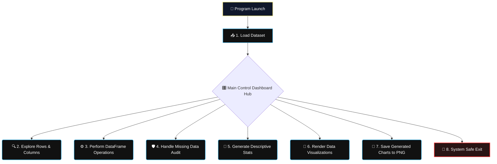

# Visualizer
# 📊 Data Analysis & Visualization Program

<div align="center">
  <!-- Premium Native CSS Animated Header Card -->
  <div style="background: linear-gradient(135deg, #0f172a 0%, #1e3a8a 100%); padding: 35px; border-radius: 12px; box-shadow: 0 6px 20px rgba(0,0,0,0.4); border: 2px solid #38bdf8; max-width: 650px; margin: 20px auto; overflow: hidden;">
    <h1 style="color: #fef08a; margin: 0 0 10px 0; font-family: 'Fira Code', monospace; font-size: 26px; text-shadow: 0 0 12px rgba(254,240,138,0.4);">📊 Pandas DataFrame Analytics Engine</h1>
    
    <!-- CSS Typing Animation -->
    <div style="display: inline-block; font-family: 'Fira Code', monospace; font-weight: 600; font-size: 16px; color: #38bdf8; border-right: 2px solid #38bdf8; white-space: nowrap; overflow: hidden; width: 0; animation: typing 4s steps(45, end) infinite alternate;">
      Data Exploration | Missing Data Audit | Matplotlib Stack Plots
    </div>
    
    <p style="color: #e2e8f0; margin: 15px 0 0 0; font-family: system-ui, sans-serif; font-size: 14px; line-height: 1.6;">
      An interactive Command Line Interface (CLI) application built to load multi-variable tabular datasets, parse missing value arrays, execute relational aggregations, and compute visual matrix charts seamlessly.
    </p>
  </div>
</div>

<style>
  @keyframes typing {
    0% { width: 0; }
    75% { width: 100%; }
    100% { width: 100%; }
  }
</style>

---

## ⚡ Core Features

Click on individual category configurations below to explore specific operation submenus:

<details open>
<summary><b>🔍 1. Tabular Dataset Exploration</b></summary>
<br>

* 🔝 **Structural Scans:** Display the first 5 rows (`head()`) or last 5 rows (`tail()`) of your active dataset instantly.
* 📑 **Metadata Profiling:** Inspect column header mapping strings, target data types (`dtypes`), and foundational database schemas with a single option.
</details>

<details>
<summary><b>🛡️ 2. Null Value Sanitization</b></summary>
<br>

* 🕵️‍♂️ **Missing Value Detection:** Scan matrix arrays to systematically flag rows containing null or empty data entries.
* 🛠️ **Smart Imputation:** Fill missing attributes using calculated column mean averages, drop damaged rows, or substitute with specific placeholder fallback strings.
</details>

<details>
<summary><b>🎛️ 3. DataFrame Operations & Descriptive Statistics</b></summary>
<br>

* 🧮 **Statistical Audit:** Instantly map data spreads utilizing summary tables detailing item count volumes, standard deviations, and quartile ranges.
* ➗ **Group & Sort Hub:** Sort matrix rows against standalone target columns or run dynamic conditional operations via relational grouping methods (`groupby`).
</details>

<details>
<summary><b>🎨 4. Matplotlib Data Visualization Suite</b></summary>
<br>

* 📊 **Plot Ecosystem:** Provision Bar charts, Line progression timelines, Scatter points, Pie distribution slices, Histograms, or customized structural **Stack Plots**.
* 💾 **Direct Disk Export:** Export generated workspace figures directly into the root directory path as high-fidelity standalone `.png` visual structures (e.g., `stack_plot.png`).
</details>

---

## 🗺️ Program Workflow Architecture

The application runs on a structural menu loop to ensure you can perform continuous calculations once a dataset is loaded into system memory:



---

## 🚀 Environment Setup & Deployment

### 1. Installation Requirements
Ensure your Python workspace has all necessary computational data science packages available before launching the initialization shell script:
```bash
pip install pandas matplotlib numpy
```

### 2. Execute Code
Run the script using your system command terminal inside the project directory:
```bash
python data_analyzer.py
```

---

## 💻 Sample Program Stream Execution Logs

```text
========== Data Analysis & Visualization Program ==========
Please select an option:
1. Load Dataset
2. Explore Data
...
== Load Dataset ==
Dataset loaded successfully!

== Explore Data ==
   SalesID    Product   Region  Sales  Year
0      101  Product B    North   2353  2021
1      102  Product D    South    939  2024

== Handle Missing Data ==
No missing values found in the dataset!

== Data Visualization ==
Generating stack plot...
Stack plot displayed successfully!

== Save Visualization ==
Visualization saved as stack_plot.png successfully!

Exiting the program. Goodbye!
```

---

<!-- GitHub-Friendly Professional UI Custom Theme Style -->
<style>
  summary {
    font-size: 1.1rem;
    padding: 14px;
    background: #0f172a;
    border-radius: 8px;
    margin-bottom: 10px;
    cursor: pointer;
    border-left: 4px solid #38bdf8;
    transition: all 0.2s ease-in-out;
    list-style: none;
    font-family: system-ui, sans-serif;
    color: #cbd5e1;
  }
  summary:hover {
    background: #1e293b;
    transform: translateX(4px);
    color: #fef08a;
  }
  summary::-webkit-details-marker {
    display: none;
  }
</style>
